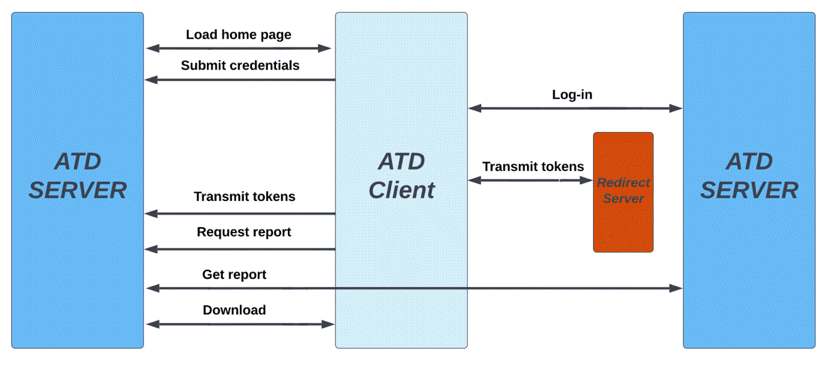

# Accounting Transaction Download

Copyright (C) 2023-2024, Haley Hashemi, Open Source Instruments Inc.  
Copyright (C) 2024, Kevan Hashemi, Open Source Instruments Inc.

## Introduction

The Accounting Transaction Download (ATD) program downloads all transactions in
a specified date range from a [Quickbooks
Online](https://quickbooks.intuit.com/online/) (QBO) company account. The data
file provided by ATD includes the company's general ledger for the specified
date range, as well as separate legers for each QBO class defined in the company
account. Each leger contains all transactions, including journal entries. Any
transaction that has been assigned a class will appear twice: once in the
general leger and once in a class leger.

The ATD process is a web server equipped with a suite of web pages. The web
server is provided by [PHP](https://www.php.net). The website is a collection of
pages that make heavy use of hyptertext preprocessing (PHP). The combination of
server and pages is what we call the "ATD server". We communicate with ATD  by
connecting to our ATD server with a web browser. So far as we can tell, any web
browser will do. 

The schematic above attempts to show the interactions that take place between
our browser, the ATD server, the QBO server, and the non-QBO server that hosts
the post-authentication redirect.

Once we have connected to the ATD server, we enter two long-term access keys
provided by Intuit to permit ATD to communicate with our QBO account. We
instruct ATD to initiate a log-in to our QBO account. The ATD server redirects
our browser to QBO, where we enter our log-in credentials. Once QBO is satisfied
that we have identified ourselves, QBO redirects our browser to yet another web
page hosted on a non-QBO server. Along with the redirect command, QBO provides
the access token it has granted us following our successful log-in. The non-QBO
server must provide a secure socket layer (SSL) and support PHP. The web page it
hosts is what we call the "post-authentication" redirect.

The post-authentication redirect takes our browser back to the ATD server, and
in doing so provides our ATD server with the access token it needs to retrieve
transactions from our QBO company. We can now instruct ATD to retrieve reports
from QBO, and we can subsequently download these reports to our own hard driver
with our web browser. 

## Registration

Prior to connecting ATD to your QBO company account, we must obtain our company
credentials on QBO and configure the ATD code. We create an Intuit Developer
account. We use the same e-mail address that we use to log in to our QBO
account. In our Intuit Developer account, we navigate to the Dashboard.

In the Dashboard, we select "Create an App", which we would prefer to describe
as "registering and application", because not application is actually created by
the process that follows our selection. We give the name of the application we
want to use with our QBO account, which is ATD. We answer a few questions about
what the application will do. Ours is an "accounting" application. It reads
accounting information but does nothing else. It makes no modifications to the
company accounts.

We will now be able to see the ATD app listed in our dashboard. Click on the ATD
app link and we will be taken to the ATD's entry in our developer account. The
ATD page provides Development and Production tabs, each with their own set of
parameters. The Development environment which contains keys and credentials that
we can use to access information about a "Sandbox Company", which is a fake
company generated by QBO to test API code on. The Production environment is the
one we must use to set up our QBO account for communication with the ATD app.
Before QBO will give us keys and credentials, we must pass through the QBO app
approval process.

## Approval

Click "Keys and Credentials" under the Production tab. A list of taks will pop
up. These tasks include verifying your email address and completing our profile.
For the terms of service links, use the ATD license link and the github.com
domain name. We will not be distributing this app on the QBO store. In place of
the URLs that allow a user to connect or disconnect to the app, we use links to
the GitHub repository. We categorize the app as "Accounting". When asked whether
or not the app will store tokens, identifiers, or secrets to disk, we say No,
because ATD stores no company information on disk. When asked what the app will
be doing with the QBO company, we say that it reads reports only. It does not
upload any information or alter the company records in any way. 

Once we are done with all the pre-approval talks, we wait half an hour, after
which QBO will either approve or reject the app. If the app is approved, our
Production company keys and credentials will be provided, and we will be
permitted to enter a "Redirect URI", where "URI" stands for "universal resource
identifier". More about the URI below.

## Credentials

Once QBO ATD is approved, we have access to our credentials. This includes the
Client ID, the Client Secret, and the Redirect URI. The Client ID and Client
Secret are keys that identify our app and enable the app to connect to your
online company. The Client ID is the public ID of the app and the Client Secret
is a private identification string. The Redirect URI is a file on a secure
server that QBO will load once we have used our own personal credentials to log
in to the QBO server. We provide two examples of redirect resources: atd_186.php
and atd_local.php. These are PHP files that we can host on a web server that
provides a PHP hypertext preprocessor. When QBO requests the URI, it passes the
access tokens, which it granted us during out login, along with its request. The
redirect URI will extract these tokens, redirects our browser to the local machine
that is running our ATD server, and provides the tokens to that server with the
redirect request. The redirect URI listed in the Production Settings of the App
should match the redirect in the ATD code. Intuit requires that the URI be
hosted on a secure server, that is: it must be an https link, it cannot be an
http link nor a local link within our own network.

## Configuration

We configure ATD with config.php. In this file we specify our redirect URI and
the IP address and port two which we want our ATD process to listen for
connections. We will interact with ATD using a web browser by opening a socket
to the IP address and port that we wpecify in config.php. You are welcome to use
the URI we provide on our own [Open Source Instruments
Inc.](https://www.opensourceinstruments.com) (OSI) secure server.

https://www.opensourceinstruments.com/HTML/Redirect/atd_local.php

We set the homeURL in config.php. By default this is "localhost:3000". We set
the baseURL in config.php. This determines the type of company the app is
accessing. To access a sandbox company, the string is "development". To access a
production company, the string is "production". 

## Operation

Install php on the ATD server machine, version 5.6 or greater. Clone the ATD 
repository, specifying the repository with the following GitHub link.

https://github.com/OSI-INC/ATD

Start the ATD process on the ATD server by navigating to the ATD directory and
entering the following command in the terminal. 

php -S localhost:3000

Here we instruct ATD to listen for a connection from the computer hosting ATD on
port 3000. In a browser on the host machine, type "localhost:3000" for the web
addres. We should see the ATD main page open in our browser, inviting us to
submit our client identifier and secret. We can access these in our development
or production settings of our app on QBO. Copy and paste them into the two entry
boxes. Our browser will save them to its memory if we permit it to do so. Click
"Submit Identifier and Secret" and ATD will store these two strings of
characters in its session memory.

Click "Connect to Company Account" and ATD takes us to QBO, where we can log
into our company's QBO account. If our QBO username is associated with more than
one company account, QBO will ask us to select the company we would like to
access. Once we have selected a company, QBO will present us with a list of
available applications as well. We should see "ATD" among them, but we do not
find it necessary to select ATD from the list before proceeding. We complete our
log-in. Our post-authorization URI should bring our browser back to the ATD main
page.

Specify ledger options: cash or accrual, start date, and end date. Press "Submit
Ledger Options". Now we can press "Read Ledger" and ATD will connect to our QBO
company and read the ledger we have specified from the company account. We press
"write ledger" to write the ledger to our hard drive as a text file. We press
"List Classes" to get a list of classes defined in our QBO account, along with
the identifying numbers that QBO has assigned to each class.

Each transaction in the ledger has the following columns, arranged in an order
dictated by QBO, rather than by how we list them when we ask for them, or how 
we list them here.

| Name             | Description                         |
|------------------|-------------------------------------|
| tx_date          | transaction date                    |
| txn_type         | transaction type                    |
| doc_num          | document number                     |
| klass_name       | class name                          |
| name             | memo                                |
| split_acc        | split account                       |
| subt_nat_amount  | amount of this transaction          |
| rbal_nat_amount  | account balance after transaction   |

If we want to add columns to the general ledger, we find the line in
read_ledger.php script that calls setColumns for the general ledger and we add
our additional columns to that call.

## Security

The ATD program never alters anything in the QBO company it reads from. Its only
function is to download accounting information from the company. Nevertheless,
the access tokens ATD obtains from QBO could, in principle, be used by a
malicious third party to read and alter your company accounts. It is important,
therefore, that you take steps to prevent any malicious actor from obtaining
your tokens.

In its default configuration, ATD uses atd_local.php on the OSI secure server
for its post-authorization redirect. Once you have ATD up and running, we ask
you to host your own redirect file on your own secure server. You can copy
atd_local.php right to your server if you like. Our redirect files keep a log of
who is using them. It would be easy for us extract and store your access token
on our own server as well. The fact that this is possible is a grievous security
risk to your company. Use our redirect resource to test your ATD server, but
switch to using your own redirect, hosted on your own secure server, as soon as
you can. We provide no guarantee whatsoever that our web server is secure enough
to prevent hackers from altering our redirect files and stealing your tokens. 

The ATD process keeps its access keys and tokens in a block of memory reserved
for our current ATD session. It never writes the keys or tokens to disk. There
is no place where we can enter default values for the keys or tokens in the ATD
code. We can instruct our web browser to remember the access keys, so that it is
easy for us to enter them when we start each ATD session. The access keys last
for several months, but eventually we have to renew them by visiting the Intuit
developer website. The access token we obtain after our log-in will last so long
as our session is active, but will be obtained only after we log into QBO using
its full authentication process.

## Comments

The ATD default configuration of ATD has the server and client running on the
same computer. We connect to the ATD server with "localhost:3000" and we use the
atd_local.php redirect resource on the OSI website. Another way to use ATD is to
set up an ATD server in our local network and assign it a static local address.
Suppose we assign our ATD server the local address 192.168.1.186. In config.php
and in our Intuit Developer Dashboard, we enter the following address for our
redirect resource:

https://www.opensourceinstruments.com/HTML/Redirect/atd_186.php

In config.php we set the HomeURI to:

http://192.168.1.186:3000

We launch ATD on the server with:

php -S 192.168.1.186:3000

Now you should be able to connect to the server from any local machine using web
address 186 on the local subnet 192.168.1".

The ATD application does not use an external package manager. If you want to use
the Composer package manager, change the include ('../config.php') at the top of
each file to the composer autoload function. The include ('../config.php') uses
the autoloader config file that acts as an SQL database query function. This is
a way of loading QBO's functions, classes, variables, etc, that are necessary
for each piece of code. 

